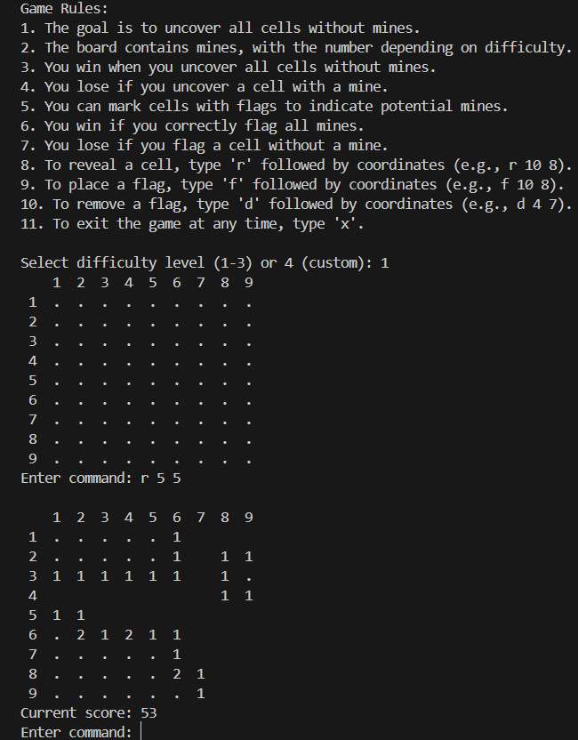
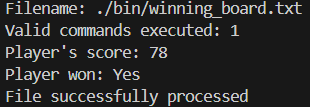

  

# MineSweeper

> A terminal-based C implementation of the classic Minesweeper puzzle.

---

## 🚀 Table of Contents

1. [Overview](#overview)
2. [Features](#features)
3. [Gameplay](#gameplay)
4. [Screenshot](#screenshot)
5. [Requirements](#requirements)
6. [Installation](#installation)
7. [Usage](#usage)
8. [Difficulty Presets](#difficulty-presets)
9. [Project Structure](#project-structure)
10. [Development](#development)
11. [Contributing](#contributing)
12. [Authors](#authors)
13. [License](#license)

---

## 📖 Overview

MineSweeper brings the classic mine-detection challenge to your terminal. Navigate the grid, reveal safe cells, and flag hidden mines without triggering any explosives!

* **Language:** C
* **Build System:** Make (via provided Makefile)
* **Interface:** Text-based (Unix, macOS, Windows via WSL/Cygwin)

---

## ✨ Features

* **Randomized mine placement** for endless replayability
* **Configurable board dimensions & mine count** (default: 9×9 with 10 mines)
* **Automatic flood-fill reveal** for contiguous safe zones
* **Flagging mechanism** to mark suspected mines
* **Real-time mine counter** displaying remaining flags
* **Lightweight and fast**—minimal dependencies
* **End-of-game leaderboard** showcasing top scores

---

## 🎮 Gameplay

### Game Rules

1. The goal is to uncover all cells without mines.
2. The board contains mines, with the number of mines depending on difficulty.
3. You win when you uncover all cells without mines.
4. You lose if you uncover a cell with a mine.
5. You can mark cells with flags to indicate potential mines.
6. You win if you correctly flag all mines.
7. You lose if you flag a cell without a mine.

### Commands

* **Reveal cell**: `r <row> <col>` (e.g., `r 10 8`)
* **Place a flag**: `f <row> <col>` (e.g., `f 10 8`)
* **Remove a flag**: `d <row> <col>` (e.g., `d 4 7`)
* **Quit game**: `x`

---

## 🖼 Screenshot



*A 9×9 board in mid-game, showing flagged mines and adjacent counts.*

---

## 🔧 Requirements

* C compiler (e.g., `gcc`)
* GNU Make
* Terminal environment (Linux, macOS, or Windows + WSL/Cygwin)

---

## ⚙️ Installation

1. **Clone the repo:**

   ```bash
   git clone https://github.com/ajmenG/MineSweeper.git
   cd MineSweeper
   ```
2. **Build:**

   ```bash
   make all
   ```
3. **Executable location:** `bin/minesweeper`

---

## ▶️ Usage

* **Interactive Mode:**

  ```bash
  ./bin/minesweeper
  ```

  Launches the game and prompts for difficulty or custom board settings.

* **File Mode:**

  ```bash
  ./bin/minesweeper -f <filename>
  ```

  Replays moves from `<filename>` and outputs game summary:

  ```text
  Filename: <filename>
  Valid commands executed: <number>
  Player's score: <score>
  Player won: <Yes/No>
  File successfully processed
  ```

  
  
  *Example of File Mode output: replaying moves from a saved file, tallying results, and displaying the final score.*

* **Automated Tests:**

  ```bash
  ./bin/minesweeper -t
  ```

  Runs the built-in test suite to verify game logic.

---

## 🧩 Difficulty Presets

| Preset       | Dimensions | Mines |
| :----------- | :--------- | :---- |
| Beginner     | 9×9        | 10    |
| Intermediate | 16×16      | 40    |
| Expert       | 30×16      | 99    |

---

## 🗂 Project Structure

```
MineSweeper/
├── bin/          # Executable
├── include/      # Header files (.h)
├── src/          # Source code (.c)
├── data/         # Assets (screenshot.png)
├── Makefile      # Build script
└── README.md     # Project documentation
```

---

## 🛠 Development

* **Clean build artifacts:** `make clean`
* **Rebuild:** `make all`

---

## 🤝 Contributing

We welcome contributions! Steps:

1. Fork this repo
2. Create a branch: `git checkout -b feature/<name>`
3. Implement your feature or fix
4. Commit with clear message
5. Push: `git push origin feature/<name>`
6. Open a Pull Request

Please adhere to existing code style and write meaningful commit messages.

---

## 👥 Authors

* **ajmenG** (Main Contributor) ([GitHub](https://github.com/ajmenG))
* **Cyprian Ciesielski** ([GitHub](https://github.com/CyprianCiesielski))

---

## 📜 License

Distributed under the MIT License. See [LICENSE](LICENSE) for details.
